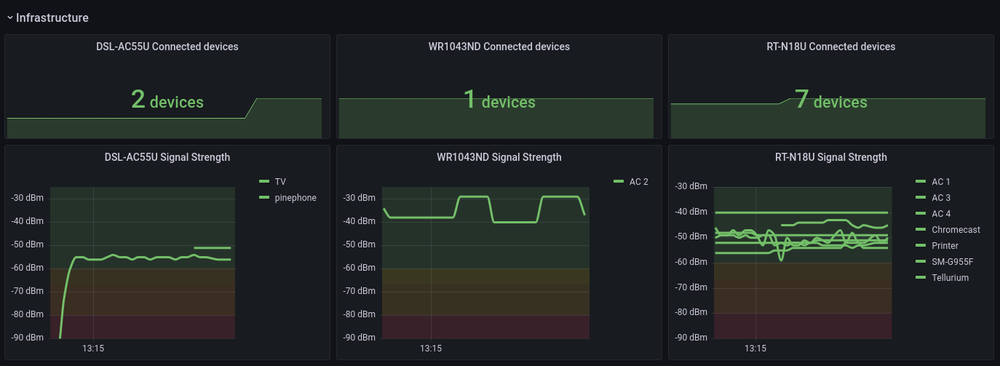

# router_prometheus




## Project goals
 - [X] YML configuration file for defining global options and routers
 - [X] Have different backends to get metrics from different routers so that the project is extendable to more router brands and systems
 - [ ] Using public key authentication in SSH
 - [X] Expose a Prometheus endpoint so metrics can be scraped by Prometheus scrapers
 - [X] Docker container

## Collected metrics

| Metric | Description | Required feature |
| :-------------- | :-------------: | -------------: |
| `ROUTER_clients_connected_INTERFACE`    | Number of devices connected to `INTERFACE`. | `signal` |
| `ROUTER_client_signal_INTERFACE_DEVICE` | Current [signal strength](https://www.securedgenetworks.com/blog/wifi-signal-strength#what-is-a-good-wifi-signal-stength) (in dBm) for each connected `DEVICE`. | `signal` |
| `ROUTER_channel_INTERFACE` | `INTERFACE`'s [channel](https://en.wikipedia.org/wiki/List_of_WLAN_channels). | `channel` |
| `ROUTER_rx_INTERFACE`, `ROUTER_tx_INTERFACE` | Total number of bytes received/transmitted on a wireless `INTERFACE`. Read from `/sys/class/net/INTERFACE/statistics/rx_bytes`. | `rxtx` |

## Available backends

| Backend | Description | Available features |
| :-------------- | :-------------: | -------------: |
| `dd-wrt`    | Should support all routers running DD-WRT. | `signal`, `channel`, `rxtx` |
| `dsl-ac55u` | Only supports the Asus DSL-AC55U | `signal`, `channel`, `rxtx` |

## Known issues
 - When a command gets stuck, it hangs the whole progam indeffinitely (caused by [this issue](https://github.com/fabric/fabric/issues/2197))
   - Same goes for losing connection
 - Something makes it crash sometimes and I'm not sure why

## Config file markup

config.yml:
```yml
port: 8080
address: 127.0.0.1
debug: yes
```

routers.yml:
```yml
DSL-AC55U:
   address: 10.0.0.1
   backend: dsl-ac55U
   transport:
      username: admin
      password: admin
RT-N18U:
   address: 10.0.0.2
   backend: dd-wrt
   transport:
      username: root
      password: admin
TL-WR1043ND:
   address: 10.0.0.3
   backend: dd-wrt
   transport:
      username: root
      use_keys: True
```

mapping.yml:
```yml
00:00:00:00:00:00: "Phone"
11:11:11:11:11:11: "Laptop"
```
